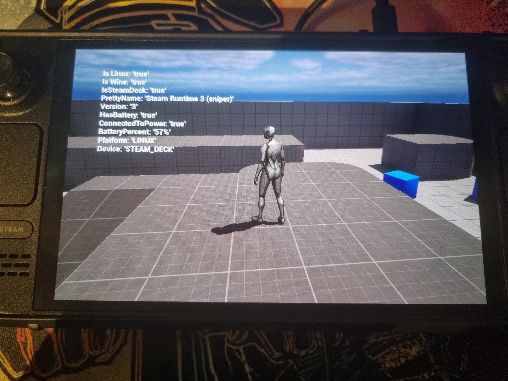

  

Welcome to HarmonyLink 2.0. This iteration represents a leap forward in enhancing the handheld gaming experience, now re-engineered as a C++ dynamic link library (DLL) for seamless integration directly into games.

## Table of Contents

- [Key Features](#key-features)
- [HarmonyLink in Action](#harmonylink-in-action)
- [Integration Guide](#integration-guide)
  - [For Game Developers](#for-game-developers)
  - [Unreal Engine 5 Plugin](#unreal-engine-5-plugin)
- [Building From Source](#building-from-source)
- [How It Works](#how-it-works)
- [Getting Started](https://github.com/Jordonbc/HarmonyLink/wiki/Getting-Started)
- [Frequently Asked Questions (FAQ)](#frequently-asked-questions-faq)
- [Contributing](#contributing)
- [License](#license)

## Key Features

- **Intelligent Hardware Recognition**: HarmonyLink 2.0 can accurately identify specific devices like the Steam Deck without relying on manual environment variables or command line arguments.
  
- **Robust API**: The API provided by HarmonyLink 2.0 offers developers straightforward and effortless access to detailed system information. Designed with intuitiveness in mind, it allows for rapid integration into projects, minimizing development overhead.

- **Enhanced Adaptability**: With the ability to dynamically adjust game settings and performance based on detected hardware capabilities and current operating conditions, HarmonyLink 2.0 ensures games are optimized for each specific device.

- **Wine Environment Detection**: HarmonyLink 2.0 includes mechanisms to detect when it is running within a Wine environment, enabling it to deliver system information about the underlying Linux system while operating through Wine.

- **Precise Steam Deck Hardware Detection**: Unlike conventional methods that may rely on environment variables, HarmonyLink 2.0 detects the presence of Steam Deck hardware directly, ensuring reliable identification and optimization for this specific device.

- **Battery and Charging Status Awareness**: The software provides real-time data on battery levels and charging status, allowing games to adapt their behavior based on power availability and to manage resource usage effectively.

- **Cross-Platform Functionality**: HarmonyLink 2.0 is designed to work on Windows (including Wine environments) as well as natively on Linux, offering broad support for a variety of gaming setups.

- **Unreal Engine 5 Compatibility**: HarmonyLink 2.0 comes with full support for Unreal Engine 5, making it a versatile tool for developers working with one of the most advanced game engines in the industry.

## HarmonyLink in Action

Experience the capabilities of HarmonyLink: Legacy (June 2023 version) with our demonstration:

<h3 align="center" style="font-size: 16pt;"> Video below ⬇️</h3>

  

     
  

The picture above shows a packaged Shipping build of a UE5 project with the HarmonyLink plugin enabled. Widgets we're added to the viewport to display these values. The values are updated on tick, with no noticable performance loss.

## Integration Guide

### For Game Developers

Integrate HarmonyLink 2.0 into your game project with ease:

1. Download the latest version of HarmonyLink 2.0 from the [releases page](https://github.com/Jordonbc/HarmonyLink/releases/latest).
2. Add the HarmonyLink DLL to your project according to your development environment's specifications.
3. Utilize the provided API to access device-specific metrics and enhance your game's performance on handheld devices.

Refer to the [integration documentation](https://github.com/Jordonbc/HarmonyLink/wiki/Integration-Guide) for detailed instructions.

### Unreal Engine 5 Plugin

For developers leveraging Unreal Engine 5.3 or newer*, HarmonyLink 2.0 is readily accessible as a plugin:

1. Clone or download the HarmonyLink UE5 Plugin from the [Unreal Engine Plugin repository](https://github.com/Jordonbc/HarmonyLinkUE5Plugin).
2. Place the HarmonyLink plugin folder into the `Plugins` directory of your Unreal Engine 5 project.
3. Enable the HarmonyLink plugin from the Edit > Plugins menu within Unreal Engine 5.
4. Access HarmonyLink functionalities via Blueprints or C++ within your project.

For a step-by-step guide, visit the [Unreal Engine 5 Plugin instructions](https://github.com/Jordonbc/HarmonyLinkUE5Plugin/wiki/Integration-Guide) on our wiki.

*With potential backward compatibility, not verified.

## Building From Source

If you prefer to build HarmonyLink 2.0 from the source code, follow these steps:

1. Clone the repository using `git clone https://github.com/Jordonbc/HarmonyLink.git`.
2. Navigate into the cloned directory with `cd HarmonyLink`.
3. Ensure CMake is installed and up-to-date on your system.
4. Generate the build configuration with `cmake -S . -B build`.
5. Compile the code by running `cmake --build build --config Release`.
6. The built DLL will be located in the `build/bin/HarmonyLinkLib` directory.

For additional building options and troubleshooting, refer to the [building from source documentation](https://github.com/Jordonbc/HarmonyLink/wiki/Building-From-Source).

## How It Works

HarmonyLink 2.0 functions without the need for a separate server application. The DLL is integrated directly into the game, providing a conduit between the game and the device hardware for real-time metrics and enhanced performance adaptability.

## Frequently Asked Questions (FAQ)

- **What new capabilities does HarmonyLink 2.0 bring?**
  HarmonyLink 2.0 offers a streamlined, more efficient way for games to interact with handheld hardware, now as a C++ DLL for easy integration without the need for server-side components.

- **How can developers integrate HarmonyLink 2.0 into their games?**
  Developers can include HarmonyLink 2.0 in their projects by adding the DLL and making API calls as needed. Detailed instructions are available on our wiki.

- **Does HarmonyLink 2.0 support Proton/Wine?**
  Yes, it includes workarounds and functionalities tailored for games running in Proton/Wine environments.

- **Does HarmonyLink 2.0 rely `STEAM_DECK=1`?**

No, HarmonyLink 2.0 does not rely on the `STEAM_DECK=1` environment variable. Instead, it employs advanced hardware detection techniques to accurately identify the presence of specific devices, such as the Steam Deck. This direct detection method ensures reliable performance optimization tailored to the actual hardware, independent of any user-modified environment settings.

## Contributing

Your contributions make HarmonyLink better. Please review our [Contributing Guidelines](CONTRIBUTING.md) for information on submitting pull requests and helping with development.

## License

HarmonyLink 2.0 is released under the GNU General Public License v3.0 or later. See the [LICENSE](LICENSE) file for details.
